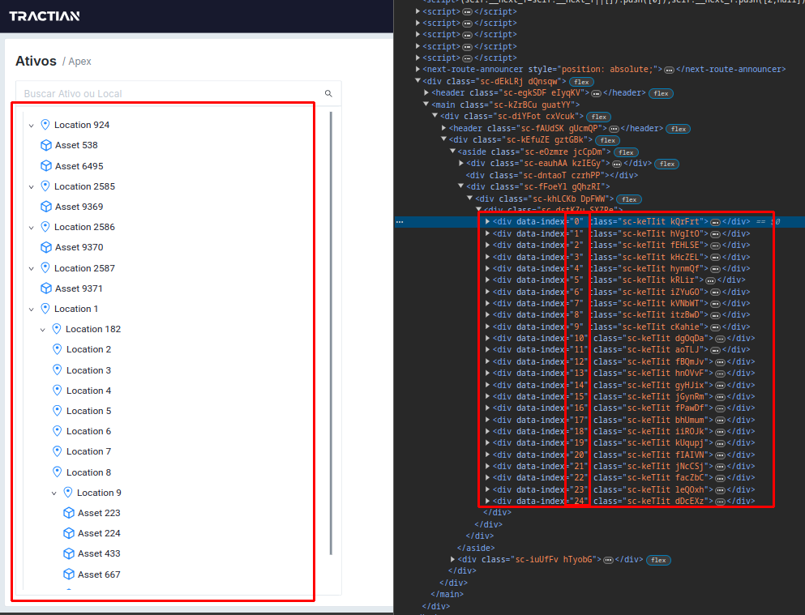

<div align="center">
  <a href="">
    
  </a>

  <h3 align="center">@Tractian Challenge</h3>

  <p align="center">
    a dashboard of companies with asset trees. 🧢
  </p>
</div>

<details>
  <summary>Table of Contents</summary>
  <ol>
    <li>
      <a href="#about-the-project">About The Project</a>
      <ul>
        <li><a href="#built-with">Built With</a></li>
      </ul>
    </li>
    <li>
      <a href="#getting-started">Getting Started</a>
      <ul>
        <li><a href="#prerequisites">Prerequisites</a></li>
        <li><a href="#installation">Installation</a></li>
      </ul>
    </li>
  </ol>
</details>


## About The Project

[![TS-TST-REACT - Environment][product-screenshot]]()

#### Live demonstration: https://tr-tst-react.vercel.app

#### Demonstration Video: https://youtu.be/4ic1Qhtfa4A

The project was developed using Next.js version 14, leveraging several key technologies such as TanStack Query, TanStack Virtual, and Zustand. These tools were essential for managing HTTP state, global state, and DOM virtualization, ensuring efficient memory allocation.

Although it's a SPA, the project is large, complex, and challenging. I aimed for a clean architecture, applying SOLID principles with service layers, a Network Service built with Axios, an API Service implemented as a singleton, and an Atomic Design approach with tokens.

The primary focus of the project was performance, particularly in rendering large lists, applying filters, and managing state, cache, and memory. DOM virtualization was crucial to ensure that, even with 50, 100, or 400 elements returned from the endpoint, only the visible items in the container were rendered. The video showcases an average of 25 items rendered at a time.

#### Virtualized/paginated DOM:
<div align="center">
  <a href="">
    
  </a>
</div>


#### Areas to improve if more time was available:

* HTTP Pagination with Infinity Query: Alongside DOM virtualization, this solution would be a highly scalable combo for handling large lists. If pagination from the endpoint wasn't possible, it could be implemented through Next.js' BFF.

* Responsiveness: Since the focus was performance, I dedicated all my time to optimization, leaving less time to work on making the app fully responsive for mobile devices.

* Using the developed multi-theme support: The structure for the Dark Theme is ready, but the project defaulted to the Light Theme. With more time, I would have adjusted the color palette and implemented a theme switcher.

* Get greater test coverage: rendering, dom, and stress testing.

### Built With

This project was developed using the following technologies:

* [![Next][Next.js]][Next-url]
* [![React][React.js]][React-url]
* [![Axios][Axios]][Axios-url]
* [![Tanstack Query][Tanstack-Query]][Tanstack-Query-url]
* [![Tanstack Virtual][Tanstack-Virtual]][Tanstack-Virtual-url]
* [![Testing-library][Testing-library]][Testing-library-url]
* [![Vitest][Vitest]][Vitest-url]
* [![Zod][Zod]][Zod-url]
* [![Zustand][Zustand]][Zustand-url]
  
## Getting Started

Prerequisites for installing and running the application locally.

### Prerequisites

* npm
  ```sh
  npm install npm@latest -g
  ```

### Installation

1. Clone the repo
   ```sh
   git clone https://github.com/andrewgerez/tr-tst-react.git
   ```
2. Install NPM packages
   ```sh
   npm install
   ```
3. Set the environment variables
   ```sh
   Example in .env.example
   ```
4. Run the app
   ```sh
   npm run dev
   ```


   or use docker :)


5. Build the container using Docker Compose
   ```sh
   docker-compose build
   ```

6. Start the container using Docker Compose
   ```sh
   docker compose up
   ```
   
## Contact

Andrew Gerez - [Linkedin](https://www.linkedin.com/in/andrewgerez/) - andrewgerez18@gmail.com

Project Link: [https://github.com/andrewgerez/tr-tst-react](https://github.com/andrewgerez/tr-tst-react)


[product-screenshot]: app/assets/readme/example2.png
[Next.js]: https://img.shields.io/badge/next.js-000000?style=for-the-badge&logo=nextdotjs&logoColor=white
[Next-url]: https://nextjs.org/
[React.js]: https://img.shields.io/badge/React-20232A?style=for-the-badge&logo=react&logoColor=61DAFB
[React-url]: https://reactjs.org/
[TanStack-Query]: https://img.shields.io/badge/tanstack%20query-orange?style=for-the-badge
[TanStack-Query-url]: https://tanstack.com/query/latest
[TanStack-Virtual]: https://img.shields.io/badge/tanstack%20virtual-purple?style=for-the-badge
[TanStack-Virtual-url]: https://tanstack.com/virtual/latest
[Zustand]: https://img.shields.io/badge/zustand-black?style=for-the-badge
[Zustand-url]: https://zustand-demo.pmnd.rs/
[Vitest]: https://img.shields.io/badge/vitest-B9FF66?style=for-the-badge
[Vitest-url]: https://vitest.dev/
[Zod]: https://img.shields.io/badge/zod-601EF9?style=for-the-badge
[Zod-url]: https://zod.dev/
[Axios]: https://img.shields.io/badge/axios-4C00B0?style=for-the-badge
[Axios-url]: https://img.shields.io/badge/axios-blue?style=for-the-badge
[Testing-library]: https://img.shields.io/badge/testing%20library-FA8072?style=for-the-badge
[Testing-library-url]: https://testing-library.com/
[Vue.js]: https://img.shields.io/badge/Vue.js-35495E?style=for-the-badge&logo=vuedotjs&logoColor=4FC08D
[Vue-url]: https://vuejs.org/
[Angular.io]: https://img.shields.io/badge/Angular-DD0031?style=for-the-badge&logo=angular&logoColor=white
[Angular-url]: https://angular.io/
[Svelte.dev]: https://img.shields.io/badge/Svelte-4A4A55?style=for-the-badge&logo=svelte&logoColor=FF3E00
[Svelte-url]: https://svelte.dev/
[Laravel.com]: https://img.shields.io/badge/Laravel-FF2D20?style=for-the-badge&logo=laravel&logoColor=white
[Laravel-url]: https://laravel.com
[Bootstrap.com]: https://img.shields.io/badge/Bootstrap-563D7C?style=for-the-badge&logo=bootstrap&logoColor=white
[Bootstrap-url]: https://getbootstrap.com
[JQuery.com]: https://img.shields.io/badge/jQuery-0769AD?style=for-the-badge&logo=jquery&logoColor=white
[JQuery-url]: https://jquery.com 
